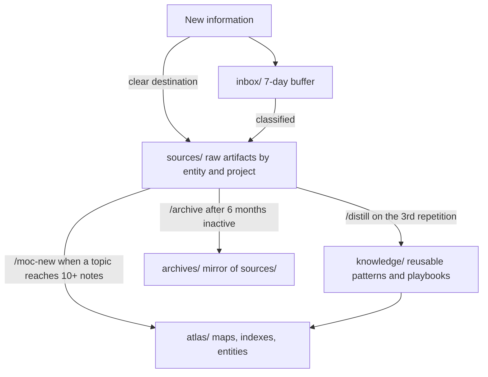

<div align="center">

# Second Brain Structure

**A ready-to-use second brain for entrepreneurs, operated from your terminal.**

Clone it, answer a fifteen-minute interview, and get a personalized knowledge workspace: plain markdown under git, typed frontmatter, and an assistant that files, distills, and retrieves everything about your work.

[](LICENSE)
[](https://claude.com/claude-code)
[](https://docs.basicmemory.com)
[](https://obsidian.md)


</div>

Where a note-taking app stops at storage, this workspace keeps going: every artifact gets a predictable address, a typed schema, and wiki-link relations, so an agent (or you, six months from now) can find it from the question alone.

## Why

The trigger is always the same story: a commitment made in a meeting that nobody wrote down, a brief buried three email threads deep, a client call that starts with five minutes of "where did we leave off". The notes exist, but they live in a doc here and an inbox there, and nothing connects them.

A second brain only works if filing is effortless and retrieval is instant. This one is built agent-first: strict path conventions, typed YAML frontmatter, and generated indexes make the whole workspace navigable by [Claude Code](https://claude.com/claude-code). You paste an email or dump your meeting notes; the agent identifies what it is, files it at the right path with the right name and the right schema, and pulls the full context back before your next call.

Methodologies like PARA or Zettelkasten rely on your discipline to keep the system coherent. Here the discipline is encoded in the structure and enforced by the tooling, and your only ritual is a weekly fifteen-minute review.

## Features

- **Guided first-run setup** (`/sb-init`): a coach-style interview (why you need this, how you work, how you communicate) that writes your charter and business context, configures your profile (agency, freelance, solopreneur, personal), and prunes the zones you will not use.
- **Three-zone architecture**: `sources/` for raw artifacts, `knowledge/` for distilled patterns, `atlas/` for maps and entities, plus an `inbox/` buffer and `archives/` for retired projects.
- **Predictable addressability**: strict naming (`YYYY-MM-DD-{type}-slug.md`), one canonical location per artifact, generated indexes. The agent guesses the path from the question alone.
- **15 typed schemas**: every note carries YAML frontmatter validated against a canonical schema (email, meeting, research, decision, person, client context, ...), so structure survives at scale.
- **Daily capture** (`/capture`): paste an email, a transcript, raw notes or an idea; the skill detects the content type, resolves the target entity and project, and files it with schema-correct frontmatter. `-i` processes the aged inbox item by item.
- **A curation cycle that keeps it alive**: `/curate` scans and proposes, `/distill` promotes recurring patterns into reusable knowledge, `/moc-new` maps dense topics, `/archive` retires dead projects. Human validation on every action.
- **Office skills included**: emails calibrated on your own voice and each contact's preferences, meeting minutes, commercial proposals, summaries, and a weekly activity dashboard.
- **Health check** (`/sb-doctor`): nine read-only checks covering orphan notes, broken conventions, frontmatter drift, stale indexes, and inbox age.
- **Semantic search** (optional): [Basic Memory](https://docs.basicmemory.com) indexes the workspace into a local knowledge graph the agent queries through MCP. Local-first, nothing leaves your machine.
- **Obsidian-ready**: graph color groups preconfigured, Dataview live indexes plus agent-readable static versions generated by script.
- **A demo client in the box**: a fictional client (Globex) with context file, emails, meeting notes and distilled knowledge, so you can see the system working before filing anything real.
- **No lock-in**: plain markdown under git. No database, no proprietary format, readable with any editor, works offline.

## Quickstart

### 1. Get the workspace

```bash
git clone https://github.com/philippe-desplats/second-brain.git my-second-brain
cd my-second-brain
claude
```

Or click **Use this template** on GitHub to start from your own repository. Either way, keep your copy private: it will hold your clients, your emails, your strategy.

### 2. Run the guided setup

Inside Claude Code:

```
/sb-init
```

The init assistant interviews you about why you want a second brain, what your work looks like, and how you communicate. It then writes your charter and context files, configures the workspace for your profile, and optionally wires up Basic Memory for semantic search. Nothing is written before you approve a recap, and `/sb-init -r` reconfigures an initialized workspace later. Fifteen minutes in, you have a working system, not an empty folder.

### 3. Start filing

Read [GETTING-STARTED.md](GETTING-STARTED.md) for your first week with the system. The short version: feed the one flow that matters most to you first (the interview identifies it), drop anything unclear into `inbox/`, and run `/curate -w 7` once a week.

## See it working before filing anything real

The workspace ships with a complete fictional client so the conventions are visible instead of theoretical:

```
sources/clients/globex/CLAUDE.md          # client context: preferences, contacts, stack
sources/clients/globex/website-redesign/  # a project: brief, emails, meeting notes
knowledge/ops/playbook-client-onboarding.md   # knowledge distilled from that work
atlas/people/jane-doe.md                  # a person file, wiki-linked everywhere
```

Open a session and ask things like "what do we know about Globex?" or "prepare a brief before my call with Jane Doe" to see retrieval in action. When you are done exploring, `/sb-init` offers to remove the demo, and `.claude/skills/sb-init/references/demo-manifest.md` lists every demo path if you prefer to delete it by hand.

## The architecture: three zones

Every note lives in one of three primary zones, decided by three questions:

| Question | Zone | Contents |
|---|---|---|
| Is it a raw artifact (email, meeting notes, deliverable, research)? | `sources/` | The raw material of your work, filed by entity and project |
| Is it distilled, reusable knowledge (pattern, playbook, guide, runbook, decision)? | `knowledge/` | What you learned, independent of any single client or project |
| Is it a map, an index, or a referenceable entity (person, topic, service)? | `atlas/` | The navigation layer: entry points, indexes, entity files |

Two utility zones complete the picture: `inbox/` (a buffer for unclassified captures, seven days maximum) and `archives/` (a mirror of `sources/` for dead projects, moved physically with `git mv`).



## What keeps it alive: the curation cycle

A second brain is maintained, not built once. Four skills form the loop:

| Skill | Role | Trigger |
|---|---|---|
| `/curate` | Scans the workspace and proposes distill / archive / map actions | Weekly review (`-w 7`) |
| `/distill` | Promotes a recurring pattern from `sources/` into `knowledge/` | Third repetition of the same topic |
| `/moc-new` | Creates a Map of Content in `atlas/maps/` | A topic reaches 10+ notes |
| `/archive` | Moves a dead project from `sources/` to `archives/` | Project done or cancelled for 6+ months |

A `librarian` agent orchestrates the cycle: it scans, scores candidates, and recommends. It never writes or moves anything without your approval.

## The skills

Thirteen skills ship with the workspace, routed through `.claude/skill-registry.md`. The daily drivers are `/capture` (inbound filing), `/curate` (the weekly review), and the office suite for outbound work.

<details>
<summary><b>Full skill registry</b></summary>

| Skill | What it does |
|---|---|
| `/sb-init` | Guided initialization and reconfiguration (`-q` quick, `-r` reconfigure) |
| `/capture` | File inbound content at the conventional path with schema frontmatter (`-i` inbox mode) |
| `/sb-doctor` | Workspace health report, nine read-only checks |
| `/curate` | Weekly or monthly review, proposes curation actions (`-r` report-only) |
| `/distill` | Promote a recurring pattern into `knowledge/` with provenance and back-links |
| `/moc-new` | Create a Map of Content for a dense topic |
| `/archive` | Retire a dead project via `git mv`, fixing references |
| `/ops-resume` | Summarize raw content (transcript, notes, article) |
| `/ops-email` | Draft emails calibrated on your voice and the recipient's preferences |
| `/ops-meeting-minutes` | Turn notes or a transcript into structured minutes |
| `/ops-proposal` | Draft a commercial proposal, never invents pricing |
| `/ops-init-project` | Bootstrap a new project folder with proper structure |
| `/ops-weekly-pulse` | Dashboard of the week's activity across all zones |

</details>

## Structure

```
├── CLAUDE.md            # Instructions loaded by Claude Code in every session
├── sources/             # Raw artifacts: {entity}/{project}/{emails|meetings|deliverables}
├── knowledge/           # Distilled knowledge: ops/ tech/ business/
├── atlas/               # Navigation: home.md, people/, topics/, services/, maps/
├── archives/            # Mirror of sources/ for inactive projects
├── inbox/               # 7-day buffer for unclassified captures
├── basic-memory/        # Schemas (typed frontmatter) and maintenance scripts
├── templates/           # Note templates (entity context, email, map of content)
└── .claude/             # Skills, rules, agents, skill registry
```

## Requirements

- **Claude Code** (required): the assistant that operates the workspace.
- **Basic Memory** (recommended): local semantic search and knowledge graph over your notes. `/sb-init` guides the installation (`uv tool install basic-memory`).
- **Obsidian** (optional): a pleasant reading and graph view. Install the community plugin **Dataview** to render the live indexes in `atlas/maps/`; agent-readable static versions are generated alongside them either way.

## Conventions at a glance

- Notes are named `YYYY-MM-DD-{type}-slug.md` (types: research, brainstorm, writing, meeting, strategy, note).
- Emails are named `YYYY-MM-DD-{seq}-{direction}-slug.md` (direction: out, in, reply).
- Nothing lives at an entity's root except its `CLAUDE.md` context file; every artifact belongs to a project folder.
- Every note carries typed YAML frontmatter conforming to one of the canonical schemas in `basic-memory/schemas/`.
- Secrets never enter the repo: `.mcp.json` is gitignored, use `.mcp.json.example` as the starting point.

## Keeping your clone up to date

Once cloned, your workspace diverges from this boilerplate by design: your notes are yours. But the infrastructure (skills, rules, schemas, scripts, templates) keeps improving upstream. To pull infrastructure updates without ever touching your data:

```bash
git remote add upstream https://github.com/philippe-desplats/second-brain.git   # once
git fetch upstream
git diff HEAD upstream/main -- .claude basic-memory templates   # review first
git checkout upstream/main -- .claude basic-memory/schemas basic-memory/scripts templates
git commit -m "chore: update workspace infrastructure from upstream"
```

Your data zones (`sources/`, `knowledge/`, `atlas/`, `archives/`, `inbox/`) are never part of that checkout. Review the diff before applying: if you customized a skill or a schema locally (for example the `service_type` enum set by `/sb-init`), re-apply your customization after the update or exclude that file from the checkout.

## Philosophy

Markdown because it survives every tool change. Git because history matters. Typed frontmatter because agents need structure to be reliable. Human validation on every curation action because a second brain you cannot trust is worse than no second brain at all.

## Acknowledgements

The term "second brain" was popularized by Tiago Forte's [Building a Second Brain](https://www.buildingasecondbrain.com/), and the zone design owes ideas to PARA and the Zettelkasten tradition. The agent-first layer is made possible by [Claude Code](https://claude.com/claude-code), [Basic Memory](https://docs.basicmemory.com), and [Obsidian](https://obsidian.md) with Dataview.

## License

[MIT](LICENSE)
