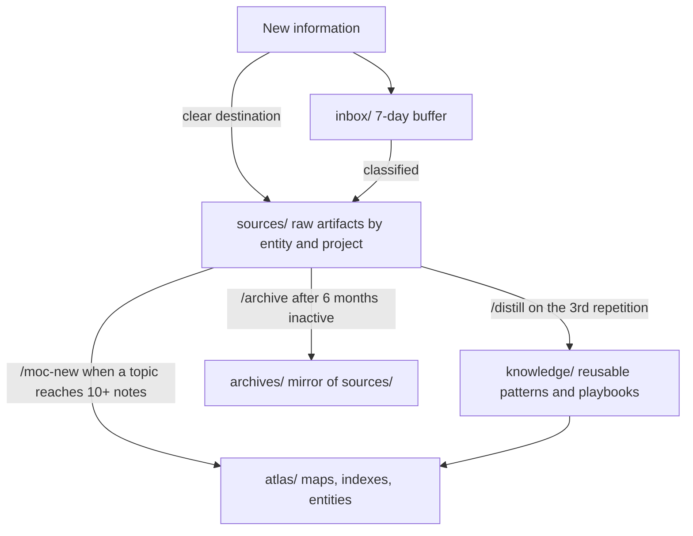

# Second Brain Structure

A ready-to-use second brain for entrepreneurs and builders. Plain markdown files, a layered architecture that both humans and AI agents can navigate, and an assistant that helps you capture, distill, and retrieve everything about your work.

Built for [Claude Code](https://claude.com/claude-code), enriched by [Basic Memory](https://docs.basicmemory.com), readable in [Obsidian](https://obsidian.md). No database, no vendor lock-in: your knowledge is a folder of text files under git.

## Quickstart

```bash
git clone <this-repo> my-second-brain
cd my-second-brain
claude
```

Then, inside Claude Code:

```
/sb-init
```

The init assistant interviews you about why you want a second brain, what your work looks like, and how you communicate. It then configures the workspace for your profile (agency, freelance, solopreneur, or personal), writes your context files, and optionally wires up Basic Memory for semantic search. Fifteen minutes later you have a working system, not an empty folder.

Then read [GETTING-STARTED.md](GETTING-STARTED.md) for your first week with the system.

## The architecture: three zones

Every note lives in one of three primary zones, decided by three questions:

| Question | Zone | Contents |
|---|---|---|
| Is it a raw artifact (email, meeting notes, deliverable, research)? | `sources/` | The raw material of your work, filed by entity and project |
| Is it distilled, reusable knowledge (pattern, playbook, guide, runbook, decision)? | `knowledge/` | What you learned, independent of any single client or project |
| Is it a map, an index, or a referenceable entity (person, topic, service)? | `atlas/` | The navigation layer: entry points, indexes, entity files |

Two utility zones complete the picture: `inbox/` (a buffer for unclassified captures, seven days maximum) and `archives/` (a mirror of `sources/` for dead projects, moved physically with `git mv`).



The design principle behind everything is **predictable addressability**: an agent (or you, six months from now) should be able to guess where a piece of information lives from the question alone. Strict path conventions, typed frontmatter, and generated indexes make that possible.

## What keeps it alive: the curation cycle

A second brain is maintained, not built once. Four skills form the loop:

| Skill | Role | Trigger |
|---|---|---|
| `/curate` | Scans the workspace and proposes distill / archive / map actions | Weekly review |
| `/distill` | Promotes a recurring pattern from `sources/` into `knowledge/` | Third repetition of the same topic |
| `/moc-new` | Creates a Map of Content in `atlas/maps/` | A topic reaches 10+ notes |
| `/archive` | Moves a dead project from `sources/` to `archives/` | Project done or cancelled for 6+ months |

A `librarian` agent orchestrates the cycle: it scans, scores candidates, and recommends. It never writes or moves anything without your approval.

## Structure

```
├── CLAUDE.md            # Instructions loaded by Claude Code in every session
├── sources/             # Raw artifacts: {entity}/{project}/{emails|meetings|deliverables}
├── knowledge/           # Distilled knowledge: ops/ tech/ business/
├── atlas/               # Navigation: home.md, people/, topics/, services/, maps/
├── archives/            # Mirror of sources/ for inactive projects
├── inbox/               # 7-day buffer for unclassified captures
├── basic-memory/        # Schemas (typed frontmatter) and maintenance scripts
├── templates/           # Note templates (entity context, email, map of content)
└── .claude/             # Skills, rules, agents, skill registry
```

## Requirements

- **Claude Code** (required): the assistant that operates the workspace.
- **Basic Memory** (recommended): local semantic search and knowledge graph over your notes. `/sb-init` guides the installation (`uv tool install basic-memory`).
- **Obsidian** (optional): a pleasant reading and graph view. Install the community plugin **Dataview** to render the live indexes in `atlas/maps/`; agent-readable static versions are generated alongside them either way.

## Conventions at a glance

- Notes are named `YYYY-MM-DD-{type}-slug.md` (types: research, brainstorm, writing, meeting, strategy, note).
- Emails are named `YYYY-MM-DD-{seq}-{direction}-slug.md` (direction: out, in, reply).
- Nothing lives at an entity's root except its `CLAUDE.md` context file; every artifact belongs to a project folder.
- Every note carries typed YAML frontmatter conforming to one of the canonical schemas in `basic-memory/schemas/`.
- Secrets never enter the repo: `.mcp.json` is gitignored, use `.mcp.json.example` as the starting point.

## Keeping your clone up to date

Once cloned, your workspace diverges from this boilerplate by design: your notes are yours. But the infrastructure (skills, rules, schemas, scripts, templates) keeps improving upstream. To pull infrastructure updates without ever touching your data:

```bash
git remote add upstream <boilerplate-repo-url>   # once
git fetch upstream
git diff HEAD upstream/main -- .claude basic-memory templates   # review first
git checkout upstream/main -- .claude basic-memory/schemas basic-memory/scripts templates
git commit -m "chore: update workspace infrastructure from upstream"
```

Your data zones (`sources/`, `knowledge/`, `atlas/`, `archives/`, `inbox/`) are never part of that checkout. Review the diff before applying: if you customized a skill or a schema locally (for example the `service_type` enum set by `/sb-init`), re-apply your customization after the update or exclude that file from the checkout.

## Philosophy

Markdown because it survives every tool change. Git because history matters. Typed frontmatter because agents need structure to be reliable. Human validation on every curation action because a second brain you cannot trust is worse than no second brain at all.
